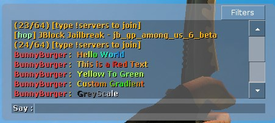

# css-gradient-chat
Counter Strike Source Colour Gradients Chat, written in AHK v1.1.33.0 
Intercepts user keys to add a special key and hex colour in front of it 
For use in Counter Strike Source with the colour server plugin 

 
Hotkeys 
 F12 - Toggle the colour chat on or off 
 F11 - Insert Special  
 F9 - Toggle between colour per word or per letter 
 
