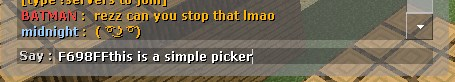

# css-gradient-chat
## About
Counter Strike Source Colour Gradients Chat, written in AHK v1.1.33.0 
This is in alpha so expect alot of bugs, incomplete features, etc 
Intercepts user keys to add a special key and hex colour in front of it automatically while typing 
Used in JBlock Jailbreak/Minigames server in Counter Strike Source with the server colour plugin 
## Introduction
Hello my JBlock neighbours, its bunnyburger with gradient chat as GUI due to popular request. 
I originally made it for myself as a goofy cool thing but others wanted it too so I made it so it has a GUI. 
 
Here is an example of it in action 
https://github.com/bunnyburger0498/css-gradient-chat/blob/main/Git_ReadMeImages/videoshow.mp4
## How to run
* [Download the latest build on the Release Page](https://github.com/bunnyburger0498/css-gradient-chat/releases) 
* Alternatively, You can download these scripts here and v1 AutoHotKey from the official site and run it via AHK. 
AutoHotKey v2 is not compatible, so make sure to download v1 if you want to use the AHK method. 
If you have experience with writing AHK stuff, feel free to edit code as you wish. 
## Simple Colour Picker
Click a colour which autocopies the code and you paste into CSS chat by pressing Ctrl+V. 
 
 
 
## Gradient Creator 
GUI subject to Usability after feature completion. 
 
## Hotkeys 
**It is highly recommended you test this out in a Untitled Notepad first to see how it works**  
### **F12**  
- Toggle the colour chat on or off. Status of toggle is displayed in windows task tray. 
  
 This means script is enabled, make sure you have a gradient loaded/created or nothing will type. 
 This means the script is suspended so you can type normally again. Gradients can still be created/loaded. 
###  **F11**  
- Insert Special paste. work in progress. only works when program is toggled for every letter.  
###  **F9**  
- Toggle between colour per word or per letter. Only works when the script is toggled on. 
- if every word is selected, the program inserts a new gradient colour everytime you press spacebar. 

 

